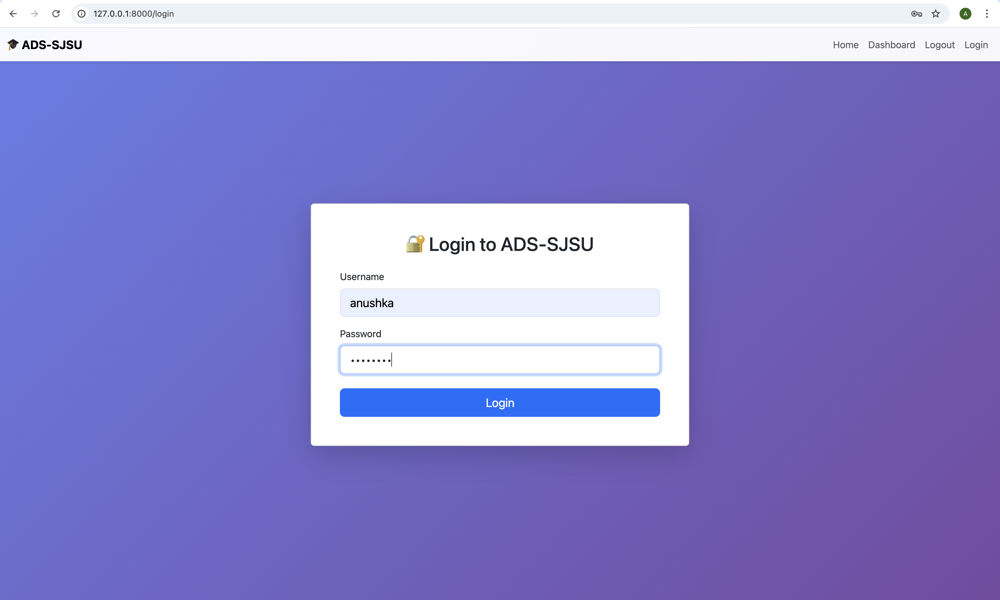
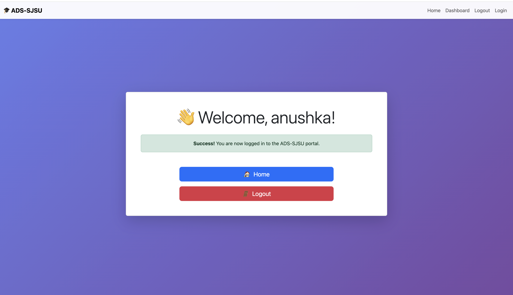

# 🔐 FastAPI Authentication System - ADS SJSU

A modern web authentication system built with FastAPI and Bootstrap for the Department of Applied Data Science at San José State University.


## 📸 Screenshots

### Login Page


### Dashboard


## ✨ Features

- 🔒 **Secure Authentication** - Session-based login/logout system
- 🛡️ **Route Protection** - Protected routes accessible only to authenticated users
- 🎨 **Bootstrap Styling** - Modern, responsive UI design
- 📱 **Mobile Responsive** - Works seamlessly on all devices
- ⚡ **FastAPI Backend** - High-performance async Python framework
- 🔐 **Session Management** - Secure cookie-based sessions with Starlette middleware
- 🚨 **Error Handling** - User-friendly error messages with Bootstrap alerts

## 🛠️ Tech Stack

- **Backend**: FastAPI 0.104.1
- **Frontend**: Bootstrap 5.3, Jinja2 Templates
- **Session Management**: Starlette SessionMiddleware
- **Server**: Uvicorn
- **Language**: Python 3.10+

## 📋 Prerequisites

- Python 3.10 or higher
- pip (Python package manager)
- Virtual environment (recommended)

## 🚀 Installation & Setup

### 1. Clone the Repository
```bash
git clone https://github.com/YOUR_USERNAME/fastapi-auth-system.git
cd fastapi-auth-system
```

### 2. Create Virtual Environment

**Mac/Linux:**
```bash
python3 -m venv venv
source venv/bin/activate
```

**Windows:**
```bash
python -m venv venv
venv\Scripts\activate
```

### 3. Install Dependencies
```bash
pip install -r requirements.txt
```

### 4. Run the Application
```bash
python main.py
```

The application will be available at: `http://127.0.0.1:8000`

## 🔑 Demo Credentials

For testing purposes, use these credentials:

| Username | Password |
|----------|----------|
| anushka | password |

## 📁 Project Structure
```
fastapi-auth-system/
│
├── main.py                 # FastAPI app initialization & middleware
├── auth.py                 # Authentication router with all routes
├── requirements.txt        # Python dependencies
├── .gitignore             # Git ignore rules
├── README.md              # This file
│
└── templates/             # Jinja2 HTML templates
    ├── base.html         # Base template with navbar
    ├── home.html         # Home page
    ├── login.html        # Login form
    └── dashboard.html    # Protected dashboard
```

## 🎯 Routes

| Route | Method | Description | Protected |
|-------|--------|-------------|-----------|
| `/` | GET | Home page with conditional content | ❌ |
| `/login` | GET | Display login form | ❌ |
| `/login` | POST | Process login credentials | ❌ |
| `/dashboard` | GET | User dashboard | ✅ |
| `/logout` | GET | Destroy session and logout | ✅ |

## 🎨 Bootstrap Components Used

- **Navbar** - Responsive navigation with dynamic links
- **Cards** - Content containers with shadow effects
- **Buttons** - Styled action buttons (primary, danger)
- **Alerts** - Error/success messages with dismiss functionality
- **Forms** - Styled input fields with validation
- **Grid System** - Responsive layout

## 📚 Documentation

### Session Management

The application uses Starlette's SessionMiddleware for managing user sessions:
```python
app.add_middleware(
    SessionMiddleware,
    secret_key=SECRET_KEY,      # Signs cookies
    session_cookie="ads_session", # Cookie name
    max_age=3600,               # 1 hour expiration
    same_site="lax",            # CSRF protection
    https_only=False            # Set True in production
)
```

### Authentication Flow
```
User visits home → Not logged in → Shows "Login" button
                      ↓
                  Click Login
                      ↓
            Enter credentials (POST /login)
                      ↓
         Validate against USERS dictionary
                      ↓
              Valid credentials?
                /              \
              YES              NO
               ↓                ↓
    Create session         Show error alert
               ↓                ↓
    Redirect to dashboard   Stay on login
               ↓
    Dashboard checks session
               ↓
       Logged in? Show content
```
## 👨‍💻 Author

**Your Name**
- GitHub: [AnushkaKhadatkar](https://github.com/AnushkaKhadatkar)
- Email: Anushkak1202@gmail.com
- LinkedIn: [Anushka Khadatkar](https://www.linkedin.com/in/anushka-khadatkar/)
- Medium: [Anushka Khadatkar] (https://medium.com/@anushkak1202)

## 🎓 Academic Context

This project was created as an assignment for the Applied Data Science program at San José State University. It demonstrates:
- Web application development with FastAPI
- Session-based authentication
- Frontend design with Bootstrap
- Security best practices
- Code organization and structure

---

*Made with ❤️ by Anushka*
